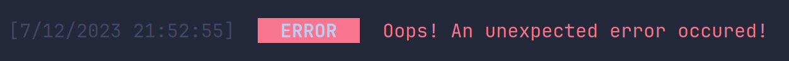

## logger.error()

The `error` function is used to print error statements in the code.

```js
logger.error(string, ConfigType?);
```

## Usage

```js
import { logger } from 'console-wizard';

logger.error('Oops! An unexpected error occured!');
```

### Output:


