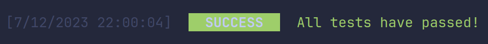

## logger.success()

The `success` function is used to display messages that state the completion of a task.

```js
logger.success(string, ConfigType?);
```

## Usage

```js
import { logger } from 'console-wizard';

logger.success('All tests have passed!');
```

### Output:


