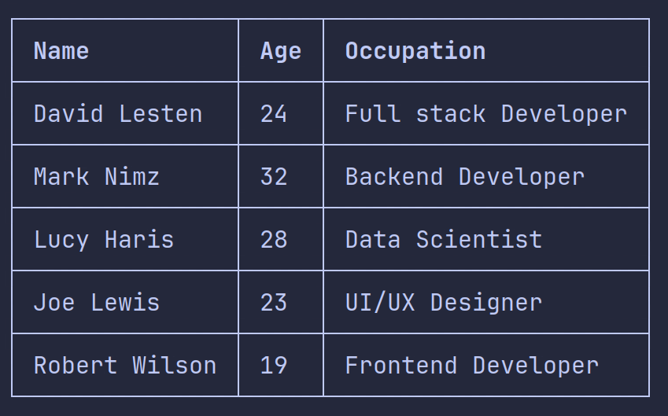

## logger.table()

The `table` function is used to print tables to the console.

```js
logger.table(TableData[], Pick<ConfigType, 'tableBorder', 'includeSN');
```

## Usage

```js
import { logger } from 'console-wizard';

logger.table([
  { name: 'David Lesten', age: 24, occupation: 'Full stack Developer' },
  { name: 'Mark Nimz', age: 32, occupation: 'Backend Developer' },
  { name: 'Lucy Haris', age: 28, occupation: 'Data Scientist' },
  { name: 'Joe Lewis', age: 23, occupation: 'UI/UX Designer' },
  { name: 'Robert Wilson', age: 19, occupation: 'Frontend Developer' },
]);
```

### Output:


