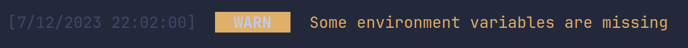

## logger.warn()

The `warn` function is used to print any warnings the project might have detected.

```js
logger.warn(string, ConfigType?);
```

## Usage

```js
import { logger } from 'console-wizard';

logger.warn('Some environment variables are missing/invalid');
```

### Output:


